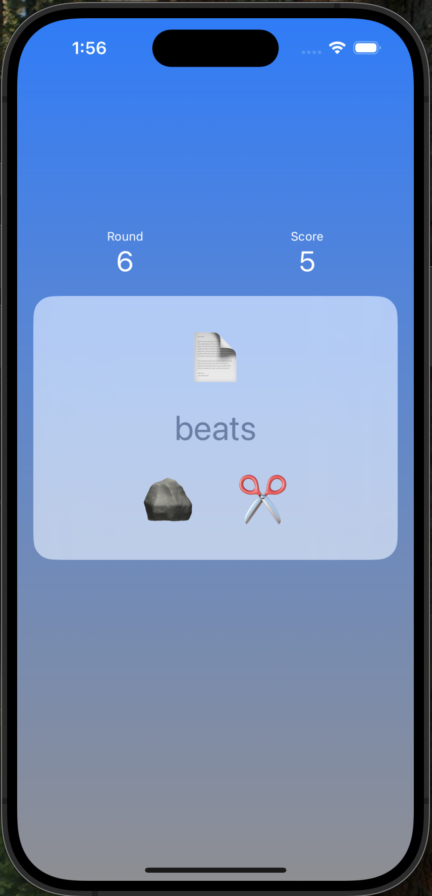
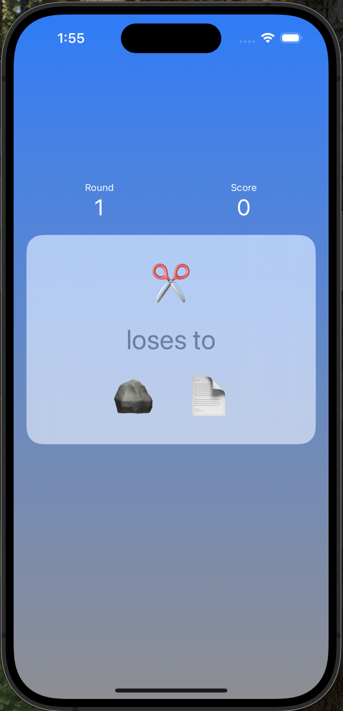
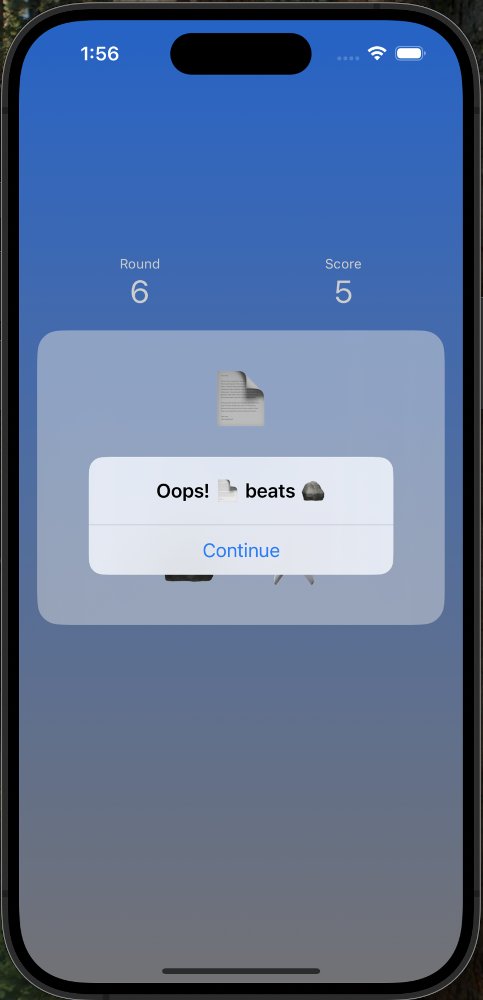
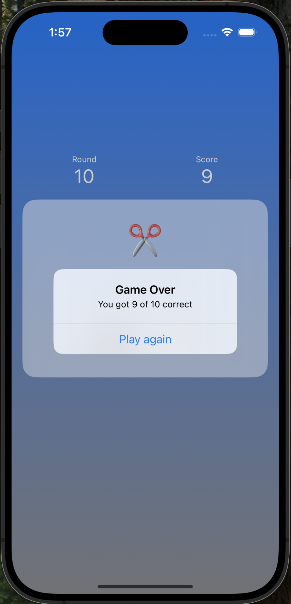

# RockPaperScissors

A solution to [the 2nd challenge of 100 Days of SwiftUI](https://www.hackingwithswift.com/guide/ios-swiftui/2/3/challenge)

The user is presented with a random move and is asked to select either the winning or losing move.

If the user makes the correct move, they get a point. Otherwise, they're presented with an alert of the correct move.

After 10 rounds, the game is over and the player is shown the final result and given the option to play again.

